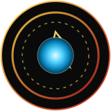

<div align="center">




<br/>

```
> BOOTING PERSONAL_SYSTEM.exe
> LOADING PROFILE: hafeelfaleel
> ARC REACTOR ............ STABLE
> COFFEE LEVELS ........... CRITICAL
> PATIENCE FOR BUGS ....... LOW
> EGO ..................... APPROPRIATELY SIZED
> STATUS .................. READY TO BUILD
```

</div>

▰▰▰▰▰▰▰▰▰▰▰▰▰▰▰▰▰▰▰▰▰▰▰▰▰▰▰▰▰▰▰▰▰▰▰▰▰▰▰▰▰▰▰▰▰▰▰▰▰▰▰▰▰▰▰▰▰▰▰▰▰▰▰▰▰▰

### 🔺 SUIT LOG

I don't wait for permission to start building — I open a terminal and figure it out. No lab full of assistants, no unlimited budget. Just a laptop, an internet connection, and a refusal to accept "that's just how it's done."

Currently running my own R&D division out of a bedroom instead of a workshop in Malibu, but the principle's the same: **prototype fast, break it faster, ship something that actually works.**

▰▰▰▰▰▰▰▰▰▰▰▰▰▰▰▰▰▰▰▰▰▰▰▰▰▰▰▰▰▰▰▰▰▰▰▰▰▰▰▰▰▰▰▰▰▰▰▰▰▰▰▰▰▰▰▰▰▰▰▰▰▰▰▰▰▰

### 🛰️ ACTIVE R&D

<table>
<tr>
<td width="70%">

**PROJECT: J.A.R.V.I.S.**
`github.com/hafeelfaleel/Jarvis`

A fully local, offline voice assistant. No cloud, no API bill, no company reading your requests — just Whisper for ears, a local LLM for a brain, and a TTS engine for a voice. Runs entirely on-device.

</td>
<td width="30%" align="center">

**BUILD LOG**
Mark I → text-only
Mark II → voice input
Mark III → wake word
Mark IV → tuned accuracy
**Mark V → real-time listening**

</td>
</tr>
</table>

▰▰▰▰▰▰▰▰▰▰▰▰▰▰▰▰▰▰▰▰▰▰▰▰▰▰▰▰▰▰▰▰▰▰▰▰▰▰▰▰▰▰▰▰▰▰▰▰▰▰▰▰▰▰▰▰▰▰▰▰▰▰▰▰▰▰

### ⚙️ LOADOUT

<div align="center">

| SYSTEM | COMPONENT |
|:--|:--|
| 🧠 **Core Logic** |  |
| 🔩 **Low-Level Plating** |  |
| 🎯 **Targeting Systems** |  |
| 🛠️ **Command Line** |  |
| 📡 **Version Control** |  |
| 🤖 **On-board AI** |  |

</div>

▰▰▰▰▰▰▰▰▰▰▰▰▰▰▰▰▰▰▰▰▰▰▰▰▰▰▰▰▰▰▰▰▰▰▰▰▰▰▰▰▰▰▰▰▰▰▰▰▰▰▰▰▰▰▰▰▰▰▰▰▰▰▰▰▰▰

### 📊 DIAGNOSTIC REPORT

<div align="center">


</div>

▰▰▰▰▰▰▰▰▰▰▰▰▰▰▰▰▰▰▰▰▰▰▰▰▰▰▰▰▰▰▰▰▰▰▰▰▰▰▰▰▰▰▰▰▰▰▰▰▰▰▰▰▰▰▰▰▰▰▰▰▰▰▰▰▰▰

<div align="center">

**FRIDAY. Or JARVIS. Still deciding which name has better branding.**

[](https://github.com/hafeelfaleel)


</div>
